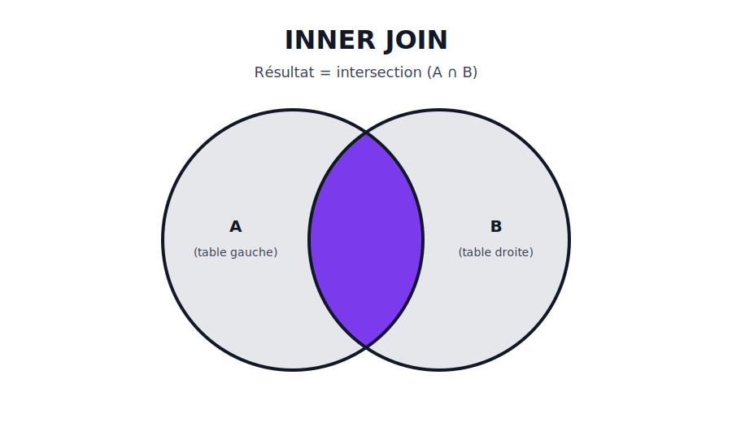
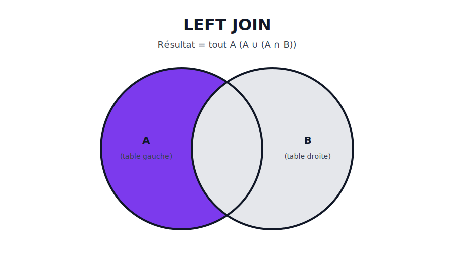

# 07 — Jointures
## Croiser des tables proprement

---

## Préparation

```sql
USE shop;
```

---

## Schéma (rappel)


---

# Récap visuel (ensembles)
## + exemples SQL

---

## `INNER JOIN` (A ∩ B)



---

## Exemple SQL — `INNER JOIN`

```sql
SELECT o.id, o.ordered_at, c.email
FROM orders o
INNER JOIN customers c ON c.id = o.customer_id
ORDER BY o.ordered_at DESC;
```

---

## `LEFT JOIN` (tout A)



---

## Exemple SQL — `LEFT JOIN`

```sql
-- Tous les clients, même sans commande
SELECT c.id, c.email, o.id AS order_id
FROM customers c
LEFT JOIN orders o ON o.customer_id = c.id
ORDER BY c.id, o.id;
```

---

## `RIGHT JOIN` (tout B)


---

## Exemple SQL — `RIGHT JOIN`

```sql
-- Même résultat qu'un LEFT JOIN, mais en inversant l'ordre des tables
SELECT c.id, c.email, o.id AS order_id
FROM orders o
RIGHT JOIN customers c ON c.id = o.customer_id
ORDER BY c.id, o.id;
```

---

## `FULL OUTER JOIN` (A ∪ B)


---

## Exemple SQL — “FULL OUTER JOIN” (simulation MySQL)

```sql
-- MySQL n'a pas de FULL OUTER JOIN natif : on le simule avec un UNION
SELECT c.id AS customer_id, c.email, o.id AS order_id
FROM customers c
LEFT JOIN orders o ON o.customer_id = c.id

UNION

SELECT c.id AS customer_id, c.email, o.id AS order_id
FROM customers c
RIGHT JOIN orders o ON o.customer_id = c.id;
```

---

## `LEFT ANTI JOIN` (A \ B)


---


## Exemple SQL — “LEFT ANTI JOIN”

```sql
-- Clients sans commande
SELECT c.id, c.email
FROM customers c
LEFT JOIN orders o ON o.customer_id = c.id
WHERE o.id IS NULL
ORDER BY c.id;
```

---

## Jointure en chaîne (3 tables)

Détail des lignes de commande :
```sql
SELECT
  o.id AS order_id,
  p.name,
  oi.quantity,
  oi.unit_price
FROM orders o
JOIN order_items oi ON oi.order_id = o.id
JOIN products p ON p.id = oi.product_id;
```

---

## Erreurs fréquentes

- Oublier la condition `ON` ⇒ produit cartésien (explosion)
- Joindre sur la mauvaise colonne (PK/FK)
- Filtrer une `LEFT JOIN` dans `WHERE` (transforme souvent en `INNER`)

---

## Ordre logique de la requête complètée avec JOIN

- FROM + JOIN (+ ON) → on construit le jeu de lignes (et pour un LEFT JOIN, on “complète” avec des NULL
    quand il n’y a pas de match)
- WHERE → on filtre les lignes obtenues
- GROUP BY → on regroupe
- HAVING → on filtre les groupes
- SELECT → on calcule les colonnes/expressions
- ORDER BY → on trie
- LIMIT/OFFSET → on découpe

---


## Exemple "piège" (à tester)

```sql
-- Objectif : garder tous les clients et afficher leurs commandes payées si elles existent
SELECT c.email, o.id AS paid_order_id
FROM customers c
LEFT JOIN orders o ON o.customer_id = c.id
WHERE o.status = 'paid';
```

---

## Version correcte (à tester)

```sql
SELECT c.email, o.id AS paid_order_id
FROM customers c
LEFT JOIN orders o
  ON o.customer_id = c.id
 AND o.status = 'paid';
```

---

## N–N (table de liaison)

Produits d’une commande :
```sql
SELECT p.id, p.name, oi.quantity
FROM order_items oi
JOIN products p ON p.id = oi.product_id
WHERE oi.order_id = 1;
```

---

## À faire (exercices)

- Exercices : `Exercices/07_jointures.md`
