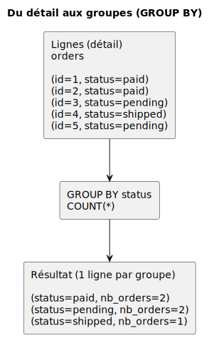

# 08 — Agrégation
## Mesurer, compter, résumer

---

## Préparation

```sql
USE shop;
```

---

## Objectif

Passer de **lignes** (détails) à des **indicateurs** (résumés) :
- combien ? (`COUNT`)
- combien au total ? (`SUM`)
- en moyenne ? (`AVG`)
- min / max ? (`MIN` / `MAX`)

---

## Fonctions d’agrégation

- `COUNT(*)` : nombre de lignes
- `COUNT(col)` : nombre de valeurs non-NULL
- `SUM(col)` : somme
- `AVG(col)` : moyenne
- `MIN(col)`, `MAX(col)` : extrêmes

---

## Partie 1 — Agrégation (sans jointures)

---

## Exemple : `COUNT(*)`

Objectif : compter le nombre total de clients.

```sql
SELECT COUNT(*) AS nb_customers
FROM customers;
```

---

## `COUNT(*)` vs `COUNT(col)`

Objectif : compter tous les clients vs uniquement ceux qui ont un téléphone.

```sql
SELECT
  COUNT(*) AS nb_customers,
  COUNT(phone) AS nb_customers_with_phone
FROM customers;
```

---

## `COUNT(DISTINCT ...)` (éviter les doublons)

Objectif : compter les clients qui ont déjà passé au moins 1 commande (et comparer au nombre total de commandes).

```sql
SELECT COUNT(DISTINCT customer_id) AS customers_who_ordered
FROM orders;
```

À comparer avec :
```sql
SELECT COUNT(*) AS nb_orders
FROM orders;
```

---

## `MIN` / `MAX` / `AVG` (exemple)

Objectif : obtenir des stats de prix sur les produits.

```sql
SELECT
  MIN(price) AS min_price,
  MAX(price) AS max_price,
  AVG(price) AS avg_price
FROM products;
```

---

## `SUM` (exemple)

Objectif : compter le stock total (toutes unités confondues).

```sql
SELECT SUM(stock) AS total_units_in_stock
FROM products;
```

---

## `GROUP BY` : 1 ligne par groupe

Objectif : compter le nombre de commandes par statut.

```sql
SELECT status, COUNT(*) AS nb_orders
FROM orders
GROUP BY status;
```

---

## Du détail aux groupes



---

## `GROUP BY` + `ORDER BY` (classement)

Objectif : trier les statuts du plus fréquent au moins fréquent.

```sql
SELECT status, COUNT(*) AS nb_orders
FROM orders
GROUP BY status
ORDER BY nb_orders DESC;
```

---

## Total par commande 

Objectif : calculer le total de chaque commande à partir de `order_items`.

```sql
SELECT
  order_id,
  SUM(quantity * unit_price) AS total
FROM order_items
GROUP BY order_id;
```

---

## `WHERE` vs `HAVING` (rappel)

`WHERE` filtre les **lignes** avant `GROUP BY`.  
`HAVING` filtre les **groupes** après `GROUP BY`.

---

## Exemple `HAVING` (moyenne par catégorie)

Objectif : garder uniquement les catégories dont le prix moyen est élevé.

```sql
SELECT category_id, AVG(price) AS avg_price
FROM products
GROUP BY category_id
HAVING AVG(price) >= 50;
```

---

## Partie 2 — Jointures + agrégation

---

## Nombre de commandes par client (avec jointure)

Objectif : compter les commandes par client (y compris ceux qui n’ont jamais commandé).

```sql
SELECT
  c.id,
  c.email,
  COUNT(o.id) AS nb_orders
FROM customers c
LEFT JOIN orders o ON o.customer_id = c.id
GROUP BY c.id, c.email
ORDER BY nb_orders DESC;
```

---

## Total par commande (avec filtre sur `orders`)

Objectif : calculer le total des commandes `paid`.

```sql
SELECT
  o.id AS order_id,
  SUM(oi.quantity * oi.unit_price) AS total
FROM orders o
JOIN order_items oi ON oi.order_id = o.id
WHERE o.status = 'paid'
GROUP BY o.id;
```

---

## Chiffre d'affaires total (paid)

Objectif : calculer le chiffre d’affaires total sur les commandes `paid`.

```sql
SELECT
  SUM(oi.quantity * oi.unit_price) AS revenue_paid
FROM orders o
JOIN order_items oi ON oi.order_id = o.id
WHERE o.status = 'paid';
```

---

## CA par client (commandes `paid`)

Objectif : calculer le total payé par client (uniquement ceux qui ont des commandes `paid`).

```sql
SELECT
  c.email,
  SUM(oi.quantity * oi.unit_price) AS total_paid
FROM customers c
JOIN orders o ON o.customer_id = c.id
JOIN order_items oi ON oi.order_id = o.id
WHERE o.status = 'paid'
GROUP BY c.id, c.email
ORDER BY total_paid DESC;
```

---

## Top produits (quantités vendues)

Objectif : trouver les 3 produits les plus vendus (en quantité).

```sql
SELECT
  p.id,
  p.name,
  SUM(oi.quantity) AS qty_sold
FROM order_items oi
JOIN products p ON p.id = oi.product_id
GROUP BY p.id, p.name
ORDER BY qty_sold DESC
LIMIT 3;
```

---

## À faire (exercices)

- Exercices : `Exercices/08_aggregation.md`
