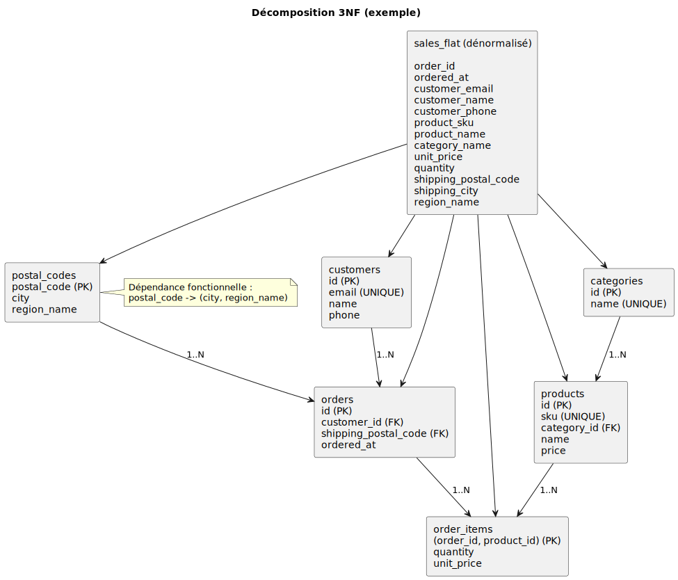

# 09 — Normalisation
## 1NF, 2NF, 3NF (avec exemples)

---

## Pourquoi normaliser ?

Éviter :
- doublons (email recopié partout)
- incohérences (2 prix différents pour le même produit)
- anomalies (update/insert/delete)

---

## Exemple “sale” (dénormalisé)

Une table unique `sales_flat` :

| order_id | customer_email | customer_name | items | total |
|---|---|---|---|---|

Problèmes :
- `items` contient une liste (valeurs multiples)
- infos client répétées
- prix/produits non maîtrisés

---

## 1NF (First Normal Form)

Règle (pratique) :
- 1 cellule = 1 valeur (pas de listes, pas de groupes répétés)
- lignes identifiables par une clé

Solution : créer une table “lignes” (`order_items`) au lieu de `items`.

---

## 2NF (Second Normal Form)

Concerne surtout les clés primaires **composées**.

Règle (pratique) :
- chaque attribut non-clé dépend de **toute** la clé

Exemple : dans `order_items(order_id, product_id)`  
`product_name` dépend de `product_id` ⇒ à mettre dans `products`.

---

## 3NF (Third Normal Form)

Règle (pratique) :
- pas de dépendance “transitive” entre attributs non-clés

---

## Décomposition (vue d'ensemble)

